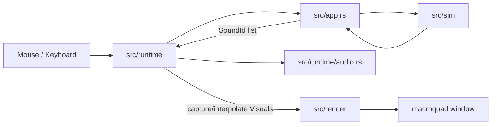
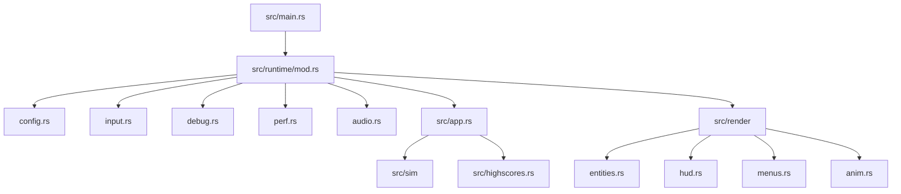
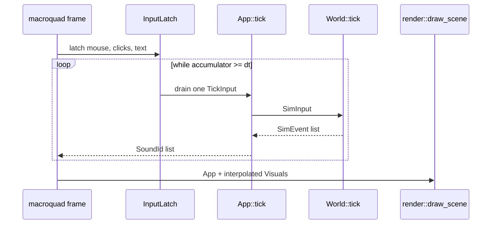
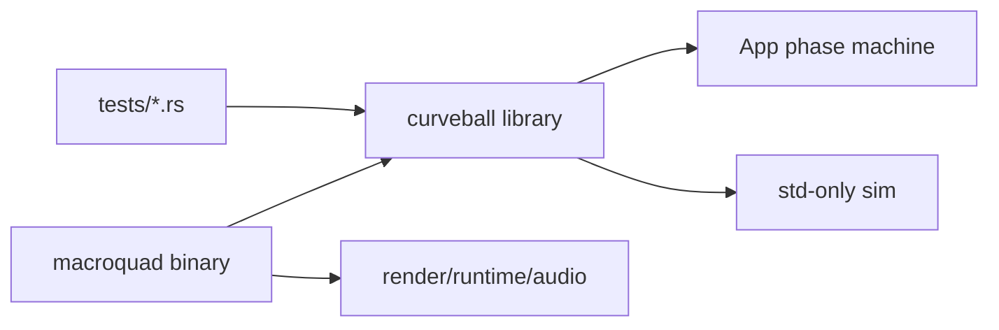

# Architecture

Curveball Rust is split around one main seam: deterministic game state in the library, platform work
in the macroquad binary.

## Module Map

## State Flow

`src/runtime/mod.rs` owns the display-frame loop:

1. Latch macroquad input in virtual 350x250 stage coordinates.
2. Accumulate wall-clock time.
3. Run zero or more fixed simulation ticks.
4. Capture previous/current render snapshots.
5. Draw one display frame through macroquad.

Faithful mode uses the original 30 Hz fixed tick. Rendering is display-rate and interpolates only
visual positions; collision, scoring, AI, timeline phases, sound events, and high-score routing still
happen inside `App::tick()`. The Faithful player paddle renders toward the latest latched mouse
sample only while no player-side contact can happen. During serve, miss-pop, and incoming player-hit
windows, the rendered paddle stays on the fixed-step snapshot so the visible hit and sound trigger
land on the same original tick.

Silky mode is intentionally non-faithful: `App::tick()` and `World::tick_silky_slice()` run at
400 Hz. The runtime late-samples the mouse immediately before rendering for Silky-only paddle
prediction, then suppresses prediction near the player plane if the predicted paddle would change the
visible hit/miss result. The Silky ball path also checks swept contact at the player and enemy depth
planes inside each 400 Hz slice.

## Determinism

The simulation module has no macroquad dependency and uses `f64` throughout, matching AS1 `Number`.
Tests call the library directly, including a GOLD-1 trajectory check that locks the normative rally.

## Reference Material

Reference assets are intentionally separated from runtime assets:

- `reference/decompiled/curveball.swf`
- `reference/decompiled/scripts/**`
- `reference/kit/*.py`
- `reference/kit/tags.json`
- `reference/kit/sounds/*`

Runtime assets live under `assets/` and are embedded into the binary.

## Audio Seam

The app intentionally keeps macroquad focused on windowing, input, and rendering. The default audio
backend uses `rodio` behind `src/runtime/audio.rs`.

That is not the canonical macroquad-only audio path. A small macroquad game would normally use
`macroquad::audio`. This project avoids that backend because enabling `macroquad/audio` starts
`quad-snd`, which can panic on WSL/Linux hosts without a usable ALSA/PipeWire PCM device before the
game can choose a silent fallback. `rodio` gives this repo a normal Rust adapter seam: device setup can
fail, the failure is logged, and the game keeps running. When audio is available, the backend decodes
the five embedded WAV clips once after opening the output stream. Each game sound then starts a fresh
overlapping source from the decoded sample buffer, matching Flash `Sound.start(0, 1)` without doing
decode work on the hit path.

## Intentional Deviations

The implementation contract is [PLAN.md](../PLAN.md). Intentional product or platform differences are
kept in [DEVIATIONS.md](../DEVIATIONS.md). The most important architectural deviations are:

- gameplay is faithful by default, but rendering is native-scale and interpolated for modern displays;
- Silky mode adds non-faithful 400 Hz world ticks, late mouse sampling, contact-aware prediction, and
  swept paddle contact;
- audio degrades to silence on broken hosts instead of crashing;
- high scores are local because the original PHP endpoints are gone;
- Zen mode is a Rust-only quality-of-life option;
- returning to the title from post-game screens starts the next game from a clean state.
